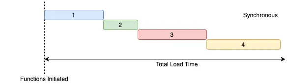
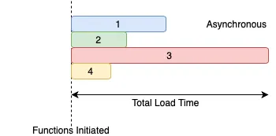
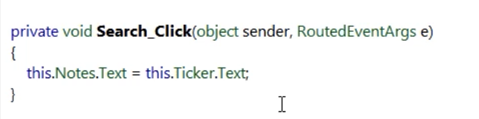
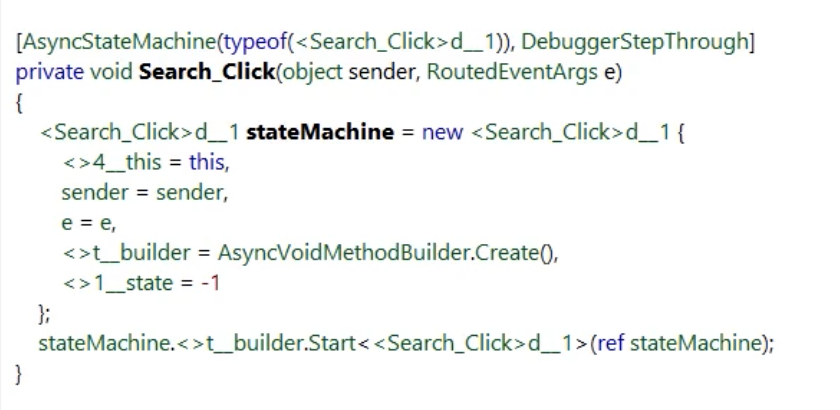

# Getting started Asynchronous Programming in .NET

We can declare a method by `async` keyword, this is the first step but it's not enough.  
We should do our jobs asynchronously in the method body.  
In asynchronous tasks, new thread will create and the task will run on that thread, by using `await` keyword we are telling that, hey, please get back the result to this thread. If we don't use `await` when the method throws an exception, we will not notify!  
One example for times that we wouldn't use `await` :  
Imagine, we are creating a registration form and we want to send a welcome email to the user after saving the user data on the database, so, we are sure that the data is saved but sending email will take a long time (like 2 minutes), does the user need to wait for email sending process!? Of course that's not a good idea to wait for the result, the user has been registered and we can show the success page to the user and on the background we can send the welcome email, in this case we dont use `await` keyword.  
Almost in 99 percent we dont use `async void` methods, if there is nothing to return by method, we use `async Task`.  
Exceptions occuring in an `async void` method can not be cought.  

Using `async` and `await` in ASP.NET means the web server can handle other requests.  

**Best Practices**
1. Never use `async void` unless it's an event handler or delegate.
2. Never block an asynchronous operation by calling `Result` or `Wait()`.
3. Always use `async` and `await` together.
4. Always return a `Task` from an asynchronous method.
5. Always `await` an asynchronous method to validate the operation.
6. Use `async` and `await` all the way up the chain.

Simplest way to conver a sync code to async code is using `Task.Run(() => { // codes } )`  
A big difference between using `await` and `ContinueWith` is the fact that `ContinueWith` is not back on the original context.  

Validate tasks even when not using `async` and `await` by chaining on a continuation.  


**Simple Await:** starts all tasks and then awaits them one-by-one. It will collect all results in the correct order. In case of an exception it will return before all tasks are completed, and it will report only the exception of the first failed task (first in order, not chronologically).
Not recommended unless this behavior is exactly what you want (most probably it isn't).  

**WhenAll:** starts all tasks and then awaits all of them to complete. It will collect all results in the correct order. In case of an exception it will return after all tasks have been completed, and it will report only the exception of the first failed task (first in order, not chronologically).
Not recommended unless this behavior is exactly what you want (most probably it isn't either).  

**WhenAny:** starts all tasks and then awaits all of them to complete. It will collect all results in order of completion, so the original order will not be preserved. In case of an exception it will return immediately, and it will report the exception of the first failed task (this time first chronologically, not in order). The while loop introduces an overhead that is absent from the other two approaches, which will be quite significant if the number of tasks is larger than 10,000, and it will grow exponentially as the number of tasks becomes larger.
Not recommended unless this behavior is exactly what you want (I bet by now you should not be a fan of this either).  

**All of these approaches:** will bombard the remote server with a huge number of concurrent requests, making it hard for that machine to respond quickly, and in the worst case triggering a defensive anti-DOS-attack mechanism.  

**A better solution** to this problem is to use the specialized API Parallel.ForEachAsync, available from .NET 6 and later. This method parallelizes multiple asynchronous operations, enforces a maximum degree of parallelism which by default is Environment.ProcessorCount, and also supports cancellation and fast completion in case of exceptions.  

Sometimes, for example in testing an API call, we don't want to call API and get data from it, in this situation we can mock the data, like creating an interface that has one method called GetData which is async method and returns a `Task<ICollection<Item>>`, so, implementation of this interface is very simple, it has just a method called GetData and returns a list of Items, but we dont do anything asyncronously, what should we do in this case? Yes, we can use Task.`FromResult(result.Where(x => x.Name == "name"))`.  

`ConfigureAwait` should be used when you don't care about the original context.  

ASP.NET Core does not need to use `ConfigureAwait` in Controllers.  
ConfigureAwait only has effects on code running in the context of a SynchronizationContext which ASP.NET Core doesn't have (ASP.NET "Legacy" does).  

General purpose code should still use it because it might be running with a SynchronizationContext.

If you are developing a Library, always use `ConfigureAwait`.  

**Remember** that continuations are executed on a different thread.  

**Working with Task**
- Task is a reference to an asynchronous operation
- Work passed to `Task.Run()` is scheduled to execute on a different thread
- Task swallow exceptions
- Continuations are executed on a different thread

Wrapping synchronous code in `Task.Run()` can be dangerous!  
Make sure there is no blocking code.  

**Parallel programming** lets you break down a large problem and compute each pice independently.  

**When to use Parallel Programming?**
- CPU bound operations
- Independent chunk of data

Parallel Programming in .NET can take many forms:
- Thread
- Task Parallel Library
- Parallel Extensions
- Parallel LINQ

Both **Asynchronous** and **Parallel** Programming enable us to finish our tasks faster.  
**Parallel Programming** in very simple terms, it is the use of multicore processors (even multiple machines) to execute a task. This type of programming takes a task, breaks it down into a series of smaller ones, delivers instructions, and processors execute the solutions at the same time  


With **Synchronous** your application will run all tasks in sequence. In other words, you fire the execution of each task and then wait until it finishes before firing the next one.  

As a result, applying Synchronous might stop the user interface (UI) thread.  

In contrast, when executing asynchronously, the program doesn’t run all tasks in sequence: it fires the tasks and then waits for their end.  


**Asynchronous** eliminates disadvantages of Synchronous. It won’t hang the UI thread (because it can run as a background task), and it can use all the cores in your machine and make better use of machine resources.  

**Implement Asynchronous and Parallel Programming in C# .NET**  
Both Asynchronous and Parallel Programming are not new in C# .NET. The Asynchronous Programming Model (APM) is the oldest model in .NET and has been available since version 1.0. Because it was complicated to implement, Microsoft introduced a new model in .NET 2.0: the Event-Based Asynchronous Pattern (EAP). EAP simplified things, but it wasn’t enough. So in .NET 4.0, Microsoft implemented a new model: the Task Parallel Library (TPL). The TPL is a huge improvement over the previous models. It simplifies parallel processing and makes better use of system resources. With TPL we can implement Parallel Programming in C# .NET very easy.  
`async` and `await` keywords were introduced in C# 5.0 by Microsoft. When you use the “Async” keyword, you can write code the same way you wrote synchronous code. The compiler takes care of all the complexity and frees you to do what you do best: writing the logic. There are some rules for writing the Async method:  
- The method signature must have the `async` keyword.
- The method name should end with Async (this is not enforced, but it is a best practice).
- The method should return `Task`, `Task<T>`, or `void`.  

To use this method, you should wait for the result (i.e., use the `await` method). Following these guidelines, when the compiler finds an await method, it starts to execute it and will continue the execution of other tasks. When the method is complete, the execution returns to its caller.  

In asynchronous programming we can schedule a continuation but in parallel we can not.  

Calling Parallel will lock the UI thread unless wrapping with `Task.Run()`.  

Misusing parallel principles in ASP.NET can cause bad performance for all users.  

To have interaction with shared variables we can use threadsafe variables, like `ConcurrentBag<T>`  

**Lock with caution, or else you might end up deadlocking.**  

Always introducing async and await is a safe way to know that the operation is awaited and potentional problems raised back to the called.  

**Asynchronous Programming**  
Asynchronous programming is a form of parallel programming where a set of statements run independently of the main programming flow.  

We use asynchronous programming when we have a blocking operation in the program and we want to continue with the execution of the program without waiting for the result. This allows us to implement tasks that can run at the same time.  

In C#, asynchronous programming is achieved through the use of the async and await keywords.  

**Multithreading**  
In computer science, a thread is a single continuous flow of control within a program. Multithreading is a technique where the processor uses multiple threads to execute multiple processes concurrently.  

We mainly use multithreading when we want to maximize the multi-core processors to have multiple workers working independently.  

In C#, the System.Threading namespace contains multiple classes and interfaces for achieving multithreading in the application.  

**Asynchronous Programming vs Multithreading**
It is a general misconception that both asynchronous programming and multithreading are the same although that’s not true. Asynchronous programming is about the asynchronous sequence of Tasks, while multithreading is about multiple threads running in parallel.  

Multithreading is a way of asynchrony in programming but we can also have single-threaded asynchronous tasks.  

The best way to see the difference is with an example.  

**Async Code Example**  
Let’s see multiple asynchronous operations in action:  

```csharp
public static async Task FirstAsync()
{
    Console.WriteLine("First Async Method on Thread with Id: " + Thread.CurrentThread.ManagedThreadId);
    await Task.Delay(1000);
    Console.WriteLine("First Async Method Continuation on Thread with Id: " + Thread.CurrentThread.ManagedThreadId);
}
public static async Task SecondAsync()
{
    Console.WriteLine("Second Async Method on Thread with Id: " + Thread.CurrentThread.ManagedThreadId);
    await Task.Delay(1000);
    Console.WriteLine("Second Async Method Continuation on Thread with Id: " + Thread.CurrentThread.ManagedThreadId);
}
public static async Task ThirdAsync()
{
    Console.WriteLine("Third Async Method on Thread with Id: " + Thread.CurrentThread.ManagedThreadId);
    await Task.Delay(1000);
    Console.WriteLine("Third Async Method Continuation on Thread with Id: " + Thread.CurrentThread.ManagedThreadId);
}
```

In each of these asynchronous methods, we write the thread id this method uses when starting the execution. Then, we simulate some work by adding a one-second delay, and finally, we print another message to the console.  

Now, let’s add another method that will execute these methods:  

```csharp
public static async Task ExecuteAsyncFunctions()
{
    var firstAsync = FirstAsync();
    var secondAsync = SecondAsync();
    var thirdAsync = ThirdAsync();
    await Task.WhenAll(firstAsync, secondAsync, thirdAsync);
}
```

Finally, we are going to modify the Main method:
```csharp
static async Task Main(string[] args)
{      
    await ExecuteAsyncFunctions();
}
```  
Let’s run our app and inspect the output:  
```
First Async Method on Thread with Id: 1
Second Async Method on Thread with Id: 1
Third Async Method on Thread with Id: 1
Third Async Method Continuation on Thread with Id: 4
Second Async Method Continuation on Thread with Id: 8
First Async Method Continuation on Thread with Id: 11
```

We can see that all the operations are starting on the same thread with a number 1. But they are continuing their execution on different threads (4, 8, 11).  

So, why is this happening?  

It’s happening because once the thread hits the awaiting operation in FirstAsync, the thread is freed from that method and returned to the thread pool. Once the operation is completed and the method has to continue, a new thread is assigned to it from a thread pool. The same process is repeated for the SecondAsync and ThirdAsync as well.  

**Multithreading Code Example**  
Now let’s try to implement the same in a multithreaded environment:  
```csharp
public class Multithreading
{
    public void FirstMethod()
    {
        Console.WriteLine("First Method on Thread with Id: " + Thread.CurrentThread.ManagedThreadId);
        Thread.Sleep(1000);
        Console.WriteLine("First Method Continuation on Thread with Id: " + Thread.CurrentThread.ManagedThreadId);
    }
    public void SecondMethod()
    {
        Console.WriteLine("Second Method on Thread with Id: " + Thread.CurrentThread.ManagedThreadId);
        Thread.Sleep(1000);
        Console.WriteLine("Second Method Continuation on Thread with Id: " + Thread.CurrentThread.ManagedThreadId);
    }
    public void ThirdMethod()
    {
        Console.WriteLine("Third Method on Thread with Id: " + Thread.CurrentThread.ManagedThreadId);
        Thread.Sleep(1000);
        Console.WriteLine("Third Method Continuation on Thread with Id: " + Thread.CurrentThread.ManagedThreadId);
    }
}
```

Also, we need to execute these methods:  
```csharp
public void ExecuteMultithreading()
{
    Thread t1 = new Thread(new ThreadStart(FirstMethod));
    Thread t2 = new Thread(new ThreadStart(SecondMethod));
    Thread t3 = new Thread(new ThreadStart(ThirdMethod));
    t1.Start();
    t2.Start();
    t3.Start();
}
```
Finally, we have to modify the Main method:  
```csharp
static async Task Main(string[] args)
{      
    await ExecuteAsyncFunctions();
    Console.WriteLine();
          
    Multithreading multithreading = new Multithreading();
    multithreading.ExecuteMultithreading();
}
```

Let’s see the output to clearly understand how they are different from each other:  
```
First Async Method on Thread with Id: 1
Second Async Method on Thread with Id: 1
Third Async Method on Thread with Id: 1
Third Async Method Continuation on Thread with Id: 4
Second Async Method Continuation on Thread with Id: 8
First Async Method Continuation on Thread with Id: 11
First Multithreading Method on Thread with Id: 14
Second Multithreading Method on Thread with Id: 15
Third Multithreading Method on Thread with Id: 16
Second Multithreading Method Continuation on Thread with Id: 15
First Multithreading Method Continuation on Thread with Id: 14
Third Multithreading Method Continuation on Thread with Id: 16
```

We can clearly see the execution of multithreaded methods on different threads as expected. But also, they are keeping the same threads for the continuation compared to the async methods.  

From this example, we can see the main difference – Multithreading is a programming technique for executing operations running on multiple threads (also called workers) where we use different threads and block them until the job is done. Asynchronous programming is the concurrent execution of multiple tasks (here the assigned thread is returned back to a thread pool once the await keyword is reached in the method).  

**Use Cases**  
Now that we understand the difference between multithreading and asynchronous programming, lets’s discuss the use cases for both of them.  

When performing blocking operations between the methods, we should use asynchronous programming. In scenarios where we have a fixed thread pool or when we need vertical scalability in the application, we use asynchronous programming.  

When we have independent functions performing independent tasks, we should use multithreading. One good example of this will be downloading multiple files from multiple tabs in a browser. Each download will run in its own thread.  

Progress reporting can be complex and difficult, although `IProgress<T>` will make it easier.  

The state machine is really there to keep track of the Tasks in your current asynchronous context. It's also in charge of executing the continuation and thus giving back the potentional results. It also ensures that a continuation executes on the correct context, which means that it also handles the context switching, and it's also in charge of reporting back the errors that you might be receiving inside your asynchronous operations that you're awaiting.  

Compiled code of clicked event handler befor adding `async` keyword to that:  
```csharp
private void Search_Click(object sender, RoutedEventArgs e)
{
    Notes.Text = Ticker.Text;
}
```
  

Compiled code after adding `async` keyword to the clicked event (without any other changes):   
```csharp
private async void Search_Click(object sender, RoutedEventArgs e)
{
    Notes.Text = Ticker.Text;
}
```


